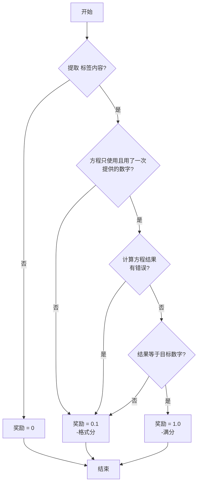

# Reproduction of TinyZero Overview

2025-08-10; 21:00~24:00

[复现TinyZero.md]


## 流程


## 数据和字段

- trainset：327680
- testset：1024


```
>>> df.columns
Index(['nums', 'target', 'data_source', 'prompt', 'ability', 'reward_model',
       'extra_info'],
      dtype='object')
>>> df[:10]
               nums  ...                      extra_info
0  [41, 70, 18, 35]  ...  {'index': 0, 'split': 'train'}
1        [7, 24, 4]  ...  {'index': 1, 'split': 'train'}
2      [55, 56, 38]  ...  {'index': 2, 'split': 'train'}
3      [95, 63, 96]  ...  {'index': 3, 'split': 'train'}
4   [60, 56, 9, 10]  ...  {'index': 4, 'split': 'train'}
5      [18, 31, 72]  ...  {'index': 5, 'split': 'train'}
6   [31, 7, 91, 51]  ...  {'index': 6, 'split': 'train'}
7   [1, 26, 69, 65]  ...  {'index': 7, 'split': 'train'}
8   [31, 98, 37, 1]  ...  {'index': 8, 'split': 'train'}
9  [57, 47, 23, 84]  ...  {'index': 9, 'split': 'train'}

[10 rows x 7 columns]
>>> print(df[0])

>>> print(df.get(0))
None
>>> for r in df.iterrows():
...     print(r)
...     break
... 
(0, nums                                             [41, 70, 18, 35]
target                                                         57
data_source                                             countdown
prompt          [{'content': 'A conversation between User and ...
ability                                                      math
reward_model    {'ground_truth': {'numbers': [41, 70, 18, 35],...
extra_info                         {'index': 0, 'split': 'train'}
Name: 0, dtype: object)
```


## 观测

日志：Wandb

nvidia 观测：

```
watch -n 1 nvidia-smi
```

Auto-dl观测：


又挂了，无语


## Rerun *n


## 参数组合

```bash
python3 -m verl.trainer.main_ppo \
data.train_files=$DATA_DIR/train.parquet \
data.val_files=$DATA_DIR/test.parquet \
data.train_batch_size=32 \
data.val_batch_size=1312 \
data.max_prompt_length=256 \
data.max_response_length=256 \
actor_rollout_ref.model.path=$BASE_MODEL \
actor_rollout_ref.actor.optim.lr=1e-6 \
actor_rollout_ref.actor.ppo_mini_batch_size=128 \
actor_rollout_ref.actor.ppo_micro_batch_size=4 \
actor_rollout_ref.rollout.log_prob_micro_batch_size=4 \
actor_rollout_ref.rollout.tensor_model_parallel_size=$ROLLOUT_TP_SIZE \
actor_rollout_ref.rollout.gpu_memory_utilization=0.35 \
actor_rollout_ref.ref.log_prob_micro_batch_size=2 \
actor_rollout_ref.ref.log_prob_micro_batch_size=4 \
critic.model.enable_gradient_checkpointing=True \
critic.optim.lr=1e-5 \
critic.model.path=$BASE_MODEL \
critic.ppo_micro_batch_size=8 \
algorithm.kl_ctrl.kl_coef=0.001 \
trainer.logger=['console'] \
+trainer.val_before_train=False \
trainer.default_hdfs_dir=null \
trainer.n_gpus_per_node=$N_GPUS \
trainer.nnodes=1 \
trainer.save_freq=100 \
trainer.test_freq=100 \
trainer.project_name=TinyZero \
trainer.experiment_name=$EXPERIMENT_NAME \
trainer.total_epochs=15 2>&1 | tee verl_demo.log

```


data.max_prompt_length=256 \ 必须大于128；有很多prompt是128~256

## 时间

```bash
root@autodl-:~/TinyZero# bash ./scripts/train_tiny_zero.sh
2025-08-10 21:56:34,342 WARNING utils.py:580 -- Detecting docker specified CPUs. In previous versions of Ray, CPU detection in containers was incorrect. Please ensure that Ray has enough CPUs allocated. As a temporary workaround to revert to the prior behavior, set `RAY_USE_MULTIPROCESSING_CPU_COUNT=1` as an env var before starting Ray. Set the env var: `RAY_DISABLE_DOCKER_CPU_WARNING=1` to mute this warning.
```


## 部分日志

```bash
(main_task pid=19799) epoch 0, step 2
(main_task pid=19799) --------------------------------
(main_task pid=19799) Target: 32 | Numbers: [ 4 29 65]
(main_task pid=19799) Extracted equation: None
(main_task pid=19799) Solution string: A conversation between User and Assistant. The user asks a question, and the Assistant solves it. The assistant first thinks about the reasoning process in the mind and then provides the user with the answer.
(main_task pid=19799) User: Using the numbers [4, 29, 65], create an equation that equals 32. You can use basic arithmetic operations (+, -, *, /) and each number can only be used once. Show your work in <think> </think> tags. And return the final answer in <answer> </answer> tags, for example <answer> (1 + 2) / 3 </answer>.
(main_task pid=19799) Assistant: Let me solve this step by step.
(main_task pid=19799) <think>Here is my thought process:</thick>
(main_task pid=19799) 
(main_task pid=19799) ````
(main_task pid=19799) I have 4 + 29
(main_task pid=19799) 4 + 29 equals 33
(main_task pid=19799) 33 divide 65 is not 32, but I will work on that later.
(main_task pid=19799) 
(main_task pid=19799) Then I may take out 5, and divide 4 + 29 (33) by 2
(main_task pid=19799) 4 + 29 (33) by 2 becomes 4 + 19 = 23
(main_task pid=19799) Now I can take out 7, and divide 65 (23) by 2 as well.
(main_task pid=19799) 65 / 2 becomes 32.5
(main_task pid=19799) I did not see a way to add +2 to 4/2 so I consider 4/2 + 2
(main_task pid=19799) 4 / 2 + 2 = 4 + 2 - 2 = 6
(main_task pid=19799) 6 will not reconcile with 33, and 33 will not reconcile with 23, so I went back and tried to add something. 
(main_task pid=19799) 
(main_task pid=19799) I changed the add of 6 to (4 + 2)/2
(main_task pid=19799) (4 + 2)/2 = 6 / 2 = 3
(main_task pid=19799) We ended up with a +2 instead of +20
(main_task pid=19799) No equation found
(main_task pid=19799) step:2 - global_seqlen/min:10372.000 - global_seqlen/max:10372.000 - global_seqlen/minmax_diff:0.000 - global_seqlen/balanced_min:10372.000 - global_seqlen/balanced_max:10372.000 - global_seqlen/mean:10372.000 - critic/kl:-0.001 - critic/kl_coeff:0.001 - critic/vf_loss:24.428 - critic/vf_clipfrac:0.000 - critic/vpred_mean:6.461 - critic/grad_norm:554.065 - mfu/critic:0.000 - critic/lr:0.000 - actor/entropy_loss:1.213 - actor/pg_loss:0.018 - actor/pg_clipfrac:0.000 - actor/ppo_kl:0.000 - actor/grad_norm:1.000 - mfu/actor:0.000 - actor/lr:0.000 - critic/score/mean:0.025 - critic/score/max:0.100 - critic/score/min:0.000 - critic/rewards/mean:0.025 - critic/rewards/max:0.101 - critic/rewards/min:-0.002 - critic/advantages/mean:-0.000 - critic/advantages/max:5.966 - critic/advantages/min:-4.406 - critic/returns/mean:0.019 - critic/returns/max:0.102 - critic/returns/min:-0.002 - critic/values/mean:6.469 - critic/values/max:18.500 - critic/values/min:-9.875 - critic/vf_explained_var:-4866.827 - response_length/mean:180.938 - response_length/max:256.000 - response_length/min:48.000 - response_length/clip_ratio:0.375 - prompt_length/mean:143.188 - prompt_length/max:146.000 - prompt_length/min:140.000 - prompt_length/clip_ratio:0.000 - timing_s/gen:5.093 - timing_s/ref:0.534 - timing_s/values:0.244 - timing_s/adv:0.041 - timing_s/update_critic:1.283 - timing_s/update_actor:1.791 - timing_s/step:8.991 - timing_per_token_ms/ref:0.051 - timing_per_token_ms/adv:0.004 - timing_per_token_ms/update_actor:0.173 - timing_per_token_ms/update_critic:0.124 - timing_per_token_ms/gen:0.880 - timing_per_token_ms/values:0.024
(main_task pid=19799) epoch 0, step 3
```

## 观测


很危险的显存


## 对比,step 52~92~122~170

step 52:

```bash
(main_task pid=19799) epoch 0, step 52
(main_task pid=19799) step:52 - global_seqlen/min:9204.000 - global_seqlen/max:9204.000 - global_seqlen/minmax_diff:0.000 - global_seqlen/balanced_min:9204.000 - global_seqlen/balanced_max:9204.000 - global_seqlen/mean:9204.000 - critic/kl:0.017 - critic/kl_coeff:0.001 - critic/vf_loss:0.094 - critic/vf_clipfrac:0.000 - critic/vpred_mean:-0.402 - critic/grad_norm:27.017 - mfu/critic:0.000 - critic/lr:0.000 - actor/entropy_loss:1.335 - actor/pg_loss:0.011 - actor/pg_clipfrac:0.000 - actor/ppo_kl:0.000 - actor/grad_norm:1.321 - mfu/actor:0.000 - actor/lr:0.000 - critic/score/mean:0.038 - critic/score/max:0.100 - critic/score/min:0.000 - critic/rewards/mean:0.036 - critic/rewards/max:0.101 - critic/rewards/min:-0.004 - critic/advantages/mean:0.000 - critic/advantages/max:4.373 - critic/advantages/min:-6.693 - critic/returns/mean:0.021 - critic/returns/max:0.101 - critic/returns/min:-0.004 - critic/values/mean:-0.402 - critic/values/max:0.260 - critic/values/min:-0.871 - critic/vf_explained_var:-5.238 - response_length/mean:143.781 - response_length/max:256.000 - response_length/min:35.000 - response_length/clip_ratio:0.281 - prompt_length/mean:143.844 - prompt_length/max:146.000 - prompt_length/min:141.000 - prompt_length/clip_ratio:0.000 - timing_s/gen:5.041 - timing_s/ref:0.537 - timing_s/values:0.295 - timing_s/adv:0.040 - timing_s/update_critic:1.234 - timing_s/update_actor:1.706 - timing_s/step:8.858 - timing_per_token_ms/ref:0.058 - timing_per_token_ms/adv:0.004 - timing_per_token_ms/update_actor:0.185 - timing_per_token_ms/update_critic:0.134 - timing_per_token_ms/gen:1.096 - timing_per_token_ms/values:0.032
```


step 92:

```bash
(main_task pid=19799) step:92 - global_seqlen/min:6456.000 - global_seqlen/max:6456.000 - global_seqlen/minmax_diff:0.000 - global_seqlen/balanced_min:6456.000 - global_seqlen/balanced_max:6456.000 - global_seqlen/mean:6456.000 - critic/kl:0.107 - critic/kl_coeff:0.001 - critic/vf_loss:0.001 - critic/vf_clipfrac:0.000 - critic/vpred_mean:0.100 - critic/grad_norm:0.477 - mfu/critic:0.000 - critic/lr:0.000 - actor/entropy_loss:0.909 - actor/pg_loss:0.113 - actor/pg_clipfrac:0.000 - actor/ppo_kl:0.000 - actor/grad_norm:2.113 - mfu/actor:0.000 - actor/lr:0.000 - critic/score/mean:0.094 - critic/score/max:0.100 - critic/score/min:0.000 - critic/rewards/mean:0.089 - critic/rewards/max:0.100 - critic/rewards/min:-0.006 - critic/advantages/mean:-0.000 - critic/advantages/max:4.170 - critic/advantages/min:-3.950 - critic/returns/mean:0.093 - critic/returns/max:0.101 - critic/returns/min:-0.006 - critic/values/mean:0.100 - critic/values/max:0.241 - critic/values/min:-0.082 - critic/vf_explained_var:-4.116 - response_length/mean:57.969 - response_length/max:199.000 - response_length/min:13.000 - response_length/clip_ratio:0.000 - prompt_length/mean:143.781 - prompt_length/max:146.000 - prompt_length/min:140.000 - prompt_length/clip_ratio:0.000 - timing_s/gen:4.192 - timing_s/ref:0.548 - timing_s/values:0.228 - timing_s/adv:0.039 - timing_s/update_critic:1.183 - timing_s/update_actor:1.697 - timing_s/step:7.891 - timing_per_token_ms/ref:0.085 - timing_per_token_ms/adv:0.006 - timing_per_token_ms/update_actor:0.263 - timing_per_token_ms/update_critic:0.183 - timing_per_token_ms/gen:2.260 - timing_per_token_ms/values:0.035
```

122:

```bash
(main_task pid=19799) epoch 0, step 122
(main_task pid=19799) step:122 - global_seqlen/min:6555.000 - global_seqlen/max:6555.000 - global_seqlen/minmax_diff:0.000 - global_seqlen/balanced_min:6555.000 - global_seqlen/balanced_max:6555.000 - global_seqlen/mean:6555.000 - critic/kl:0.131 - critic/kl_coeff:0.001 - critic/vf_loss:0.018 - critic/vf_clipfrac:0.000 - critic/vpred_mean:-0.103 - critic/grad_norm:10.464 - mfu/critic:0.000 - critic/lr:0.000 - actor/entropy_loss:0.792 - actor/pg_loss:-0.080 - actor/pg_clipfrac:0.000 - actor/ppo_kl:0.000 - actor/grad_norm:1.704 - mfu/actor:0.000 - actor/lr:0.000 - critic/score/mean:0.094 - critic/score/max:0.100 - critic/score/min:0.000 - critic/rewards/mean:0.087 - critic/rewards/max:0.098 - critic/rewards/min:-0.007 - critic/advantages/mean:-0.000 - critic/advantages/max:4.250 - critic/advantages/min:-4.760 - critic/returns/mean:0.081 - critic/returns/max:0.101 - critic/returns/min:-0.007 - critic/values/mean:-0.103 - critic/values/max:0.075 - critic/values/min:-0.291 - critic/vf_explained_var:-0.691 - response_length/mean:61.094 - response_length/max:256.000 - response_length/min:24.000 - response_length/clip_ratio:0.031 - prompt_length/mean:143.750 - prompt_length/max:146.000 - prompt_length/min:140.000 - prompt_length/clip_ratio:0.000 - timing_s/gen:4.860 - timing_s/ref:0.525 - timing_s/values:0.271 - timing_s/adv:0.041 - timing_s/update_critic:1.204 - timing_s/update_actor:1.728 - timing_s/step:8.635 - timing_per_token_ms/ref:0.080 - timing_per_token_ms/adv:0.006 - timing_per_token_ms/update_actor:0.264 - timing_per_token_ms/update_critic:0.184 - timing_per_token_ms/gen:2.486 - timing_per_token_ms/values:0.041
```

critic/rewards/mean:0.036 

critic/rewards/mean:0.089 

critic/rewards/mean:0.087

- critic/rewards/mean:0.119（step 170:

还是有进步，可惜我算力太小了，一天估计跑不完1个epoch，15个就更别提了。

## 计算预算

2025-08-10 21:56:34 到 22:22:00 是170个step，每个 step是32个sample

5,440个sample

数据集有 327680；327680/5440=60.24倍；

60.24*26.5min =1,596.36分钟=26.606 小时

一个4090 ￥2.18/小时，训完一个epoch要 58 块钱。15个epoch * 58=870 元。

显存已经是巅峰了，23.2G/24G


23.2G 显存，已经是巅峰了


# goodcase

一张4090+0.5B 还要什么自行车，有good case就够了

可以欢呼了已经


# 代码理解

```
countdown.py
```

1. extract_solution(solution_str)

- 作用：从模型输出的字符串中提取 `<answer>...</answer>` 标签内的最终答案（算式）。
- 步骤：先定位 "Assistant:" 或 "<|im_start|>assistant"，再用正则提取 `<answer>...</answer>`，返回最后一个匹配内容。
- 简言之：实现方法是【正则】+ 【特殊token】；目的是实现 【LLM输出】到【某种格式化答案】的转换。

------

2. validate_equation(equation_str, available_numbers)

- 作用：校验提取出的算式是否只用了一次、且全部用上了给定的数字。
- 步骤：提取算式中的所有数字，与 ground_truth 的数字排序后逐一比对。
- 简言之：【规则校验】

------

3. evaluate_equation(equation_str)

- 作用：安全地计算算式的数值结果。
- 步骤：只允许数字、运算符、括号和空格，使用受限的 eval 计算表达式，防止代码注入。
- 简言之：【rlvr】数学任务就是好；有确定的结果

------

4. compute_score(solution_str, ground_truth, ...)

- 作用：主评分函数。根据模型输出和标准答案，给出 reward 分数。
- 步骤：
  1. 提取算式（extract_solution）
  2. 校验数字使用（validate_equation）
  3. 计算算式结果（evaluate_equation）
  4. 若算式正确且结果等于 target，返回满分（score）；否则返回格式分（format_score）；无算式返回0。
- 简言之：+1绝对正确；0格式都不对；0.1 其他（单个数字、用选中的数字、校验正确）

## 奖励分数总结


## 流程图





