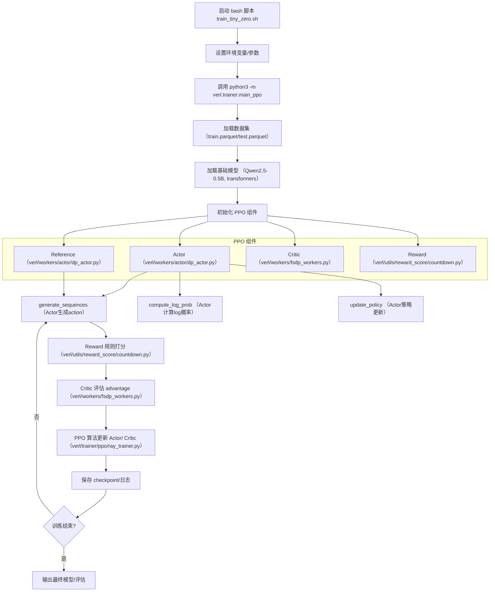
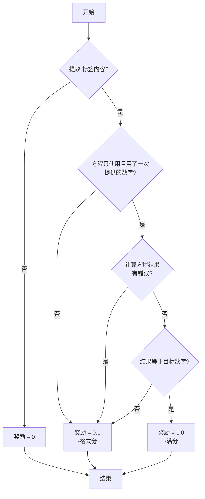

# 0. Reproduction of TinyZero Overview

2025-08-10; 21:00~24:00

Westwood_Lin





# 1. 环境 tlEf5sR+IMfF


- 显卡 5090：32GB；后面换了 4090 24G；原因：CUDA适配问题
- 镜像：TinyZero
- 3块一小时
- 版本： python 3.12.3 

```
tensorboard                       2.16.2
tensorboard-data-server           0.7.2
tensordict                        0.5.0
terminado                         0.18.1
tiktoken                          0.9.0
tinycss2                          1.3.0
tokenizers                        0.21.0
torch                             2.4.0
torchvision                       0.19.0
tornado                           6.4
...
traitlets                         5.14.3
transformers                      4.47.1
triton                            3.0.0
truststore                        0.8.0
types-python-dateutil             2.9.0.20240316
typing_extensions                 4.12.2
tzdata                            2025.1
uri-template                      1.3.0
urllib3                           2.1.0
uvicorn                           0.34.0
uvloop                            0.21.0
verl                              0.1            /root/TinyZero
vllm                              0.6.3
```


test:

```bash
> nvidia-smi
> ... CUDA: 12.8
 39%   30C    P8             13W /  575W |       1MiB /  32607MiB
```

32GB对于 Qwen 2.5-3B-Instruct 绝对够了。

对推理W4KV8来说，3B是 3* 10e9 * int4 (4Byte)= 12G左右；加上KV Cache 应该也差不多12G；再配上 beam search 等参数，32G应该是够得。


# 2. 数据IO

## 数据大小：300K+1024


- trainset：327680
- testset：1024


数据和字段：

```
>>> df.columns
Index(['nums', 'target', 'data_source', 'prompt', 'ability', 'reward_model',
       'extra_info'],
      dtype='object')
>>> df[:10]
               nums  ...                      extra_info
0  [41, 70, 18, 35]  ...  {'index': 0, 'split': 'train'}
1        [7, 24, 4]  ...  {'index': 1, 'split': 'train'}
2      [55, 56, 38]  ...  {'index': 2, 'split': 'train'}
3      [95, 63, 96]  ...  {'index': 3, 'split': 'train'}
4   [60, 56, 9, 10]  ...  {'index': 4, 'split': 'train'}
5      [18, 31, 72]  ...  {'index': 5, 'split': 'train'}
6   [31, 7, 91, 51]  ...  {'index': 6, 'split': 'train'}
7   [1, 26, 69, 65]  ...  {'index': 7, 'split': 'train'}
8   [31, 98, 37, 1]  ...  {'index': 8, 'split': 'train'}
9  [57, 47, 23, 84]  ...  {'index': 9, 'split': 'train'}

[10 rows x 7 columns]
>>> print(df[0])

>>> print(df.get(0))
None
>>> for r in df.iterrows():
...     print(r)
...     break
... 
(0, nums                                             [41, 70, 18, 35]
target                                                         57
data_source                                             countdown
prompt          [{'content': 'A conversation between User and ...
ability                                                      math
reward_model    {'ground_truth': {'numbers': [41, 70, 18, 35],...
extra_info                         {'index': 0, 'split': 'train'}
Name: 0, dtype: object)
```


## 日志：Wandb


## 启动参数


# 3. 运行启动脚本


## Debug

```bash
(base) root@autodl-container-5776409e39-3b896115:~/TinyZero# sudo ./scripts/train_tiny_zero.sh
bash: ./scripts/train_tiny_zero.sh: Permission denied
(base) root@autodl-container-5776409e39-3b896115:~/TinyZero# chmod +x ./scripts/train_tiny_zero.sh 
(base) root@autodl-container-5776409e39-3b896115:~/TinyZero# ./scripts/train_tiny_zero.sh
2025-08-10 21:02:22,796 WARNING utils.py:580 -- Detecting docker specified CPUs. In previous versions of Ray, CPU detection in containers was incorrect. Please ensure that Ray has enough CPUs allocated. As a temporary workaround to revert to the prior behavior, set `RAY_USE_MULTIPROCESSING_CPU_COUNT=1` as an env var before starting Ray. Set the env var: `RAY_DISABLE_DOCKER_CPU_WARNING=1` to mute this warning.
2025-08-10 21:02:23,987 INFO worker.py:1841 -- Started a local Ray instance.
(main_task pid=7773) {'actor_rollout_ref': {'actor': {'clip_ratio': 0.2,
(main_task pid=7773)                                  'entropy_coeff': 0.001,
(main_task pid=7773)                                  'fsdp_config': {'fsdp_size': -1,
(main_task pid=7773)                                                  'grad_offload': False,
(main_task pid=7773)                                                  'optimizer_offload': False,
(main_task pid=7773)                                                  'param_offload': False,
(main_task pid=7773)                                                  'wrap_policy': {'min_num_params': 0}},
(main_task pid=7773)                                  'grad_clip': 1.0,
(main_task pid=7773)                                  'kl_loss_coef': 0.001,
(main_task pid=7773)                                  'kl_loss_type': 'low_var_kl',
(main_task pid=7773)                                  'optim': {'lr': 1e-06,
(main_task pid=7773)                                            'lr_warmup_steps_ratio': 0.0,
(main_task pid=7773)                                            'min_lr_ratio': None,
(main_task pid=7773)                                            'total_training_steps': -1,
(main_task pid=7773)                                            'warmup_style': 'constant'},
(main_task pid=7773)                                  'ppo_epochs': 1,
(main_task pid=7773)                                  'ppo_max_token_len_per_gpu': 16384,
(main_task pid=7773)                                  'ppo_micro_batch_size': 8,
(main_task pid=7773)                                  'ppo_mini_batch_size': 128,
(main_task pid=7773)                                  'shuffle': False,
(main_task pid=7773)                                  'strategy': 'fsdp',
(main_task pid=7773)                                  'ulysses_sequence_parallel_size': 1,
(main_task pid=7773)                                  'use_dynamic_bsz': False,
(main_task pid=7773)                                  'use_kl_loss': False},
(main_task pid=7773)                        'hybrid_engine': True,
(main_task pid=7773)                        'model': {'enable_gradient_checkpointing': False,
(main_task pid=7773)                                  'external_lib': None,
(main_task pid=7773)                                  'override_config': {},
(main_task pid=7773)                                  'path': '/root/TinyZero/model/qwen2505B',
(main_task pid=7773)                                  'use_remove_padding': False},
(main_task pid=7773)                        'ref': {'fsdp_config': {'fsdp_size': -1,
(main_task pid=7773)                                                'param_offload': False,
(main_task pid=7773)                                                'wrap_policy': {'min_num_params': 0}},
(main_task pid=7773)                                'log_prob_max_token_len_per_gpu': 16384,
(main_task pid=7773)                                'log_prob_micro_batch_size': 4,
(main_task pid=7773)                                'log_prob_use_dynamic_bsz': False,
(main_task pid=7773)                                'ulysses_sequence_parallel_size': 1},
(main_task pid=7773)                        'rollout': {'do_sample': True,
(main_task pid=7773)                                    'dtype': 'bfloat16',
(main_task pid=7773)                                    'enforce_eager': True,
(main_task pid=7773)                                    'free_cache_engine': True,
(main_task pid=7773)                                    'gpu_memory_utilization': 0.4,
(main_task pid=7773)                                    'ignore_eos': False,
(main_task pid=7773)                                    'load_format': 'dummy_dtensor',
(main_task pid=7773)                                    'log_prob_max_token_len_per_gpu': 16384,
(main_task pid=7773)                                    'log_prob_micro_batch_size': 8,
(main_task pid=7773)                                    'log_prob_use_dynamic_bsz': False,
(main_task pid=7773)                                    'max_num_batched_tokens': 8192,
(main_task pid=7773)                                    'max_num_seqs': 1024,
(main_task pid=7773)                                    'n': 1,
(main_task pid=7773)                                    'name': 'vllm',
(main_task pid=7773)                                    'prompt_length': 256,
(main_task pid=7773)                                    'response_length': 1024,
(main_task pid=7773)                                    'temperature': 1.0,
(main_task pid=7773)                                    'tensor_model_parallel_size': 1,
(main_task pid=7773)                                    'top_k': -1,
(main_task pid=7773)                                    'top_p': 1}},
(main_task pid=7773)  'algorithm': {'adv_estimator': 'gae',
(main_task pid=7773)                'gamma': 1.0,
(main_task pid=7773)                'kl_ctrl': {'kl_coef': 0.001, 'type': 'fixed'},
(main_task pid=7773)                'kl_penalty': 'kl',
(main_task pid=7773)                'lam': 1.0},
(main_task pid=7773)  'critic': {'cliprange_value': 0.5,
(main_task pid=7773)             'forward_max_token_len_per_gpu': 32768,
(main_task pid=7773)             'forward_micro_batch_size': 8,
(main_task pid=7773)             'grad_clip': 1.0,
(main_task pid=7773)             'model': {'enable_gradient_checkpointing': True,
(main_task pid=7773)                       'external_lib': None,
(main_task pid=7773)                       'fsdp_config': {'fsdp_size': -1,
(main_task pid=7773)                                       'grad_offload': False,
(main_task pid=7773)                                       'optimizer_offload': False,
(main_task pid=7773)                                       'param_offload': False,
(main_task pid=7773)                                       'wrap_policy': {'min_num_params': 0}},
(main_task pid=7773)                       'override_config': {},
(main_task pid=7773)                       'path': '/root/TinyZero/model/qwen2505B',
(main_task pid=7773)                       'tokenizer_path': '/root/TinyZero/model/qwen2505B',
(main_task pid=7773)                       'use_remove_padding': False},
(main_task pid=7773)             'optim': {'lr': 1e-05,
(main_task pid=7773)                       'lr_warmup_steps_ratio': 0.0,
(main_task pid=7773)                       'min_lr_ratio': None,
(main_task pid=7773)                       'total_training_steps': -1,
(main_task pid=7773)                       'warmup_style': 'constant'},
(main_task pid=7773)             'ppo_epochs': 1,
(main_task pid=7773)             'ppo_max_token_len_per_gpu': 32768,
(main_task pid=7773)             'ppo_micro_batch_size': 8,
(main_task pid=7773)             'ppo_mini_batch_size': 128,
(main_task pid=7773)             'shuffle': False,
(main_task pid=7773)             'strategy': 'fsdp',
(main_task pid=7773)             'ulysses_sequence_parallel_size': 1,
(main_task pid=7773)             'use_dynamic_bsz': False},
(main_task pid=7773)  'data': {'max_prompt_length': 256,
(main_task pid=7773)           'max_response_length': 1024,
(main_task pid=7773)           'prompt_key': 'prompt',
(main_task pid=7773)           'return_raw_chat': False,
(main_task pid=7773)           'return_raw_input_ids': False,
(main_task pid=7773) /root/miniconda3/lib/python3.12/site-packages/vllm/connections.py:8: RuntimeWarning: Failed to read commit hash:
(main_task pid=7773) No module named 'vllm._version'
(main_task pid=7773)   from vllm.version import __version__ as VLLM_VERSION
(pid=8238) /root/miniconda3/lib/python3.12/site-packages/vllm/connections.py:8: RuntimeWarning: Failed to read commit hash:
(pid=8238) No module named 'vllm._version'
(pid=8238)   from vllm.version import __version__ as VLLM_VERSION
(WorkerDict pid=8238) Flash Attention 2.0 only supports torch.float16 and torch.bfloat16 dtypes, but the current dype in Qwen2ForTokenClassification is torch.float32. You should run training or inference using Automatic Mixed-Precision via the `with torch.autocast(device_type='torch_device'):` decorator, or load the model with the `torch_dtype` argument. Example: `model = AutoModel.from_pretrained("openai/whisper-tiny", attn_implementation="flash_attention_2", torch_dtype=torch.float16)`
(WorkerDict pid=8238) You are attempting to use Flash Attention 2.0 with a model not initialized on GPU. Make sure to move the model to GPU after initializing it on CPU with `model.to('cuda')`.
(WorkerDict pid=8238) Some weights of Qwen2ForTokenClassification were not initialized from the model checkpoint at /root/TinyZero/model/qwen2505B and are newly initialized: ['score.bias', 'score.weight']
(WorkerDict pid=8238) You should probably TRAIN this model on a down-stream task to be able to use it for predictions and inference.
(WorkerDict pid=8238) /root/miniconda3/lib/python3.12/site-packages/torch/cuda/__init__.py:230: UserWarning: 
(WorkerDict pid=8238) NVIDIA GeForce RTX 5090 with CUDA capability sm_120 is not compatible with the current PyTorch installation.
(WorkerDict pid=8238) The current PyTorch install supports CUDA capabilities sm_50 sm_60 sm_70 sm_75 sm_80 sm_86 sm_90.
(WorkerDict pid=8238) If you want to use the NVIDIA GeForce RTX 5090 GPU with PyTorch, please check the instructions at https://pytorch.org/get-started/locally/
(WorkerDict pid=8238) 
(WorkerDict pid=8238)   warnings.warn(
(WorkerDict pid=8238) /root/miniconda3/lib/python3.12/site-packages/torch/distributed/fsdp/_init_utils.py:440: UserWarning: FSDP is switching to use `NO_SHARD` instead of ShardingStrategy.FULL_SHARD since the world size is 1.
(WorkerDict pid=8238)   warnings.warn(
(main_task pid=7773)           'tokenizer': None,
(main_task pid=7773)           'train_batch_size': 256,
(main_task pid=7773)           'train_files': '/root/TinyZero/dataset/train.parquet',
(main_task pid=7773)           'val_batch_size': 1312,
(main_task pid=7773)           'val_files': '/root/TinyZero/dataset/test.parquet'},
(main_task pid=7773)  'reward_model': {'enable': False,
(main_task pid=7773)                   'forward_max_token_len_per_gpu': 32768,
(main_task pid=7773)                   'max_length': None,
(main_task pid=7773)                   'micro_batch_size': 64,
(main_task pid=7773)                   'model': {'external_lib': None,
(main_task pid=7773)                             'fsdp_config': {'min_num_params': 0,
(main_task pid=7773)                                             'param_offload': False},
(main_task pid=7773)                             'input_tokenizer': '/root/TinyZero/model/qwen2505B',
(main_task pid=7773)                             'path': '~/models/FsfairX-LLaMA3-RM-v0.1',
(main_task pid=7773)                             'use_remove_padding': False},
(main_task pid=7773)                   'strategy': 'fsdp',
(main_task pid=7773)                   'ulysses_sequence_parallel_size': 1,
(main_task pid=7773)                   'use_dynamic_bsz': False},
(main_task pid=7773)  'trainer': {'critic_warmup': 0,
(main_task pid=7773)              'default_hdfs_dir': None,
(main_task pid=7773)              'default_local_dir': 'checkpoints/TinyZero/countdown-qwen2.5-0.5b',
(main_task pid=7773)              'experiment_name': 'countdown-qwen2.5-0.5b',
(main_task pid=7773)              'logger': ['wandb'],
(main_task pid=7773)              'n_gpus_per_node': 1,
(main_task pid=7773)              'nnodes': 1,
(main_task pid=7773)              'project_name': 'TinyZero',
(main_task pid=7773)              'save_freq': 100,
(main_task pid=7773)              'test_freq': 100,
(main_task pid=7773)              'total_epochs': 15,
(main_task pid=7773)              'total_training_steps': None,
(main_task pid=7773)              'val_before_train': False}}
(main_task pid=7773) original dataset len: 327680
(main_task pid=7773) filter dataset len: 327680
(main_task pid=7773) original dataset len: 1024
(main_task pid=7773) filter dataset len: 1024
(main_task pid=7773) Size of train dataloader: 1280
(main_task pid=7773) Size of val dataloader: 1
(main_task pid=7773) Total training steps: 19200
(WorkerDict pid=8238) Critic overriding config {'bos_token_id': None, 'eos_token_id': 151643, 'pad_token_id': 151643}
(WorkerDict pid=8238) Qwen2ForTokenClassification contains 494.03M parameters
(WorkerDict pid=8238) Before critic FSDP, memory allocated (GB): 0.0, memory reserved (GB): 0.0
Error executing job with overrides: ['data.train_files=/root/TinyZero/dataset/train.parquet', 'data.val_files=/root/TinyZero/dataset/test.parquet', 'data.train_batch_size=256', 'data.val_batch_size=1312', 'data.max_prompt_length=256', 'data.max_response_length=1024', 'actor_rollout_ref.model.path=/root/TinyZero/model/qwen2505B', 'actor_rollout_ref.actor.optim.lr=1e-6', 'actor_rollout_ref.actor.ppo_mini_batch_size=128', 'actor_rollout_ref.actor.ppo_micro_batch_size=8', 'actor_rollout_ref.rollout.log_prob_micro_batch_size=8', 'actor_rollout_ref.rollout.tensor_model_parallel_size=1', 'actor_rollout_ref.rollout.gpu_memory_utilization=0.4', 'actor_rollout_ref.ref.log_prob_micro_batch_size=4', 'critic.model.enable_gradient_checkpointing=True', 'critic.optim.lr=1e-5', 'critic.model.path=/root/TinyZero/model/qwen2505B', 'critic.ppo_micro_batch_size=8', 'algorithm.kl_ctrl.kl_coef=0.001', 'trainer.logger=[wandb]', '+trainer.val_before_train=False', 'trainer.default_hdfs_dir=null', 'trainer.n_gpus_per_node=1', 'trainer.nnodes=1', 'trainer.save_freq=100', 'trainer.test_freq=100', 'trainer.project_name=TinyZero', 'trainer.experiment_name=countdown-qwen2.5-0.5b', 'trainer.total_epochs=15']
Traceback (most recent call last):
  File "/root/TinyZero/verl/trainer/main_ppo.py", line 103, in main
    ray.get(main_task.remote(config))
  File "/root/miniconda3/lib/python3.12/site-packages/ray/_private/auto_init_hook.py", line 21, in auto_init_wrapper
    return fn(*args, **kwargs)
           ^^^^^^^^^^^^^^^^^^^
  File "/root/miniconda3/lib/python3.12/site-packages/ray/_private/client_mode_hook.py", line 103, in wrapper
    return func(*args, **kwargs)
           ^^^^^^^^^^^^^^^^^^^^^
  File "/root/miniconda3/lib/python3.12/site-packages/ray/_private/worker.py", line 2772, in get
    values, debugger_breakpoint = worker.get_objects(object_refs, timeout=timeout)
                                  ^^^^^^^^^^^^^^^^^^^^^^^^^^^^^^^^^^^^^^^^^^^^^^^^
  File "/root/miniconda3/lib/python3.12/site-packages/ray/_private/worker.py", line 919, in get_objects
    raise value.as_instanceof_cause()
ray.exceptions.RayTaskError(RuntimeError): ray::main_task() (pid=7773, ip=172.17.0.2)
  File "/root/TinyZero/verl/trainer/main_ppo.py", line 188, in main_task
    trainer.init_workers()
  File "/root/TinyZero/verl/trainer/ppo/ray_trainer.py", line 502, in init_workers
    self.critic_wg.init_model()
  File "/root/TinyZero/verl/single_controller/ray/base.py", line 42, in func
    output = ray.get(output)
             ^^^^^^^^^^^^^^^
           ^^^^^^^^^^^^^^^^^^^
           ^^^^^^^^^^^^^^^^^^^^^
                                  ^^^^^^^^^^^^^^^^^^^^^^^^^^^^^^^^^^^^^^^^^^^^^^^^
ray.exceptions.RayTaskError(RuntimeError): ray::WorkerDict.critic_init_model() (pid=8238, ip=172.17.0.2, actor_id=ca446e1715b3caa9f068cb9c01000000, repr=<verl.single_controller.ray.base.WorkerDict object at 0x7f97c234c290>)
           ^^^^^^^^^^^^^^^^^^^^^^^^^^^^^^^^^^^^
           ^^^^^^^^^^^^^^^^^^^^^^^^^^^^^^^
  File "/root/TinyZero/verl/single_controller/ray/base.py", line 399, in func
    return getattr(self.worker_dict[key], name)(*args, **kwargs)
           ^^^^^^^^^^^^^^^^^^^^^^^^^^^^^^^^^^^^^^^^^^^^^^^^^^^^^
  File "/root/TinyZero/verl/single_controller/base/decorator.py", line 404, in inner
    return func(*args, **kwargs)
           ^^^^^^^^^^^^^^^^^^^^^
  File "/root/TinyZero/verl/workers/fsdp_workers.py", line 657, in init_model
    self.critic_module, self.critic_optimizer, self.critic_lr_scheduler = self._build_critic_model_optimizer(
                                                                          ^^^^^^^^^^^^^^^^^^^^^^^^^^^^^^^^^^^
  File "/root/TinyZero/verl/workers/fsdp_workers.py", line 622, in _build_critic_model_optimizer
    critic_module = FSDP(critic_module,
                    ^^^^^^^^^^^^^^^^^^^
  File "/root/miniconda3/lib/python3.12/site-packages/torch/distributed/fsdp/fully_sharded_data_parallel.py", line 483, in __init__
    _auto_wrap(
  File "/root/miniconda3/lib/python3.12/site-packages/torch/distributed/fsdp/_wrap_utils.py", line 102, in _auto_wrap
    _recursive_wrap(**recursive_wrap_kwargs, **root_kwargs)  # type: ignore[arg-type]
    ^^^^^^^^^^^^^^^^^^^^^^^^^^^^^^^^^^^^^^^^^^^^^^^^^^^^^^^
  File "/root/miniconda3/lib/python3.12/site-packages/torch/distributed/fsdp/wrap.py", line 544, in _recursive_wrap
    wrapped_child, num_wrapped_params = _recursive_wrap(
                                        ^^^^^^^^^^^^^^^^
  File "/root/miniconda3/lib/python3.12/site-packages/torch/distributed/fsdp/wrap.py", line 544, in _recursive_wrap
    wrapped_child, num_wrapped_params = _recursive_wrap(
                                        ^^^^^^^^^^^^^^^^
  File "/root/miniconda3/lib/python3.12/site-packages/torch/distributed/fsdp/wrap.py", line 544, in _recursive_wrap
    wrapped_child, num_wrapped_params = _recursive_wrap(
                                        ^^^^^^^^^^^^^^^^
  File "/root/miniconda3/lib/python3.12/site-packages/torch/distributed/fsdp/wrap.py", line 562, in _recursive_wrap
    return _wrap(module, wrapper_cls, **kwargs), nonwrapped_numel
           ^^^^^^^^^^^^^^^^^^^^^^^^^^^^^^^^^^^^
  File "/root/miniconda3/lib/python3.12/site-packages/torch/distributed/fsdp/wrap.py", line 491, in _wrap
    return wrapper_cls(module, **kwargs)
           ^^^^^^^^^^^^^^^^^^^^^^^^^^^^^
  File "/root/miniconda3/lib/python3.12/site-packages/torch/distributed/fsdp/fully_sharded_data_parallel.py", line 509, in __init__
    _init_param_handle_from_module(
  File "/root/miniconda3/lib/python3.12/site-packages/torch/distributed/fsdp/_init_utils.py", line 596, in _init_param_handle_from_module
    _sync_module_params_and_buffers(
  File "/root/miniconda3/lib/python3.12/site-packages/torch/distributed/fsdp/_init_utils.py", line 1094, in _sync_module_params_and_buffers
    _sync_params_and_buffers(
  File "/root/miniconda3/lib/python3.12/site-packages/torch/distributed/utils.py", line 326, in _sync_params_and_buffers
    dist._broadcast_coalesced(
RuntimeError: CUDA error: no kernel image is available for execution on the device
CUDA kernel errors might be asynchronously reported at some other API call, so the stacktrace below might be incorrect.
For debugging consider passing CUDA_LAUNCH_BLOCKING=1
Compile with `TORCH_USE_CUDA_DSA` to enable device-side assertions.

Set the environment variable HYDRA_FULL_ERROR=1 for a complete stack trace.
(base) root@autodl-container-5776409e39-3b896115:~/TinyZero# 
```

可惜，5090太新，对这个版本不适用啊。

```
问题分析
你的显卡（RTX 5090，CUDA sm_120）太新，当前 PyTorch 版本不支持该显卡的 CUDA 架构。导致 CUDA kernel 无法加载，训练无法进行。
```

## 更换 4090

重新Run：

```bash
root@autodl-container-db1b4a84a7-f9186d0f:~/TinyZero# # 1. 设置模型路径（假设模型在 model/qwen2505B）
export BASE_MODEL=$(realpath ./model/qwen2505B)

# 2. 设置数据集路径
export DATA_DIR=$(realpath ./dataset)

# 3. 设置 GPU 数量（4090 单卡为1，多卡请改为实际数量）
export N_GPUS=1

# 4. 设置并行度（一般与 GPU 数量一致，或根据实际需求调整）
export ROLLOUT_TP_SIZE=1

# 5. 设置实验名称
bash ./scripts/train_tiny_zero.sh 先执行 wandb login）
2025-08-10 21:22:00,229 WARNING utils.py:580 -- Detecting docker specified CPUs. In previous versions of Ray, CPU detection in containers was incorrect. Please ensure that Ray has enough CPUs allocated. As a temporary workaround to revert to the prior behavior, set `RAY_USE_MULTIPROCESSING_CPU_COUNT=1` as an env var before starting Ray. Set the env var: `RAY_DISABLE_DOCKER_CPU_WARNING=1` to mute this warning.
2025-08-10 21:22:01,486 INFO worker.py:1841 -- Started a local Ray instance.
...
```


## 训练观测：wandb失败


似乎还在执行 cpu 任务

看了下发现还是挂了：wandb 国内连不上


改成 console

## 再次启动

启动时间：2025-08-10 21:26:51,770

```bash
root@autodl-container-db1b4a84a7-f9186d0f:~/TinyZero# bash ./scripts/train_tiny_zero.sh
2025-08-10 21:26:51,770 WARNING utils.py:580 
```


显存不够

```bash
torch.OutOfMemoryError: CUDA out of memory. Tried to allocate 4.64 GiB. GPU 0 has a total capacity of 23.55 GiB of which 4.22 GiB is free. Including non-PyTorch memory, this process has 0 bytes memory in use. Of the allocated memory 16.80 GiB is allocated by PyTorch, and 1.87 GiB is reserved by PyTorch but unallocated. If reserved but unallocated memory is large try setting PYTORCH_CUDA_ALLOC_CONF=expandable_segments:True to avoid fragmentation.  See documentation for Memory Management  (https://pytorch.org/docs/stable/notes/cuda.html#environment-variables)

Set the environment variable HYDRA_FULL_ERROR=1 for a complete stack trace.
```


## 显存OOM问题


origin params:

```bash
python3 -m verl.trainer.main_ppo \
data.train_files=$DATA_DIR/train.parquet \
data.val_files=$DATA_DIR/test.parquet \
data.train_batch_size=256 \
data.val_batch_size=1312 \
data.max_prompt_length=256 \
data.max_response_length=1024 \
actor_rollout_ref.model.path=$BASE_MODEL \
actor_rollout_ref.actor.optim.lr=1e-6 \
actor_rollout_ref.actor.ppo_mini_batch_size=128 \
actor_rollout_ref.actor.ppo_micro_batch_size=8 \
actor_rollout_ref.rollout.log_prob_micro_batch_size=8 \
actor_rollout_ref.rollout.tensor_model_parallel_size=$ROLLOUT_TP_SIZE \
actor_rollout_ref.rollout.gpu_memory_utilization=0.4 \
actor_rollout_ref.ref.log_prob_micro_batch_size=4 \
critic.model.enable_gradient_checkpointing=True \
critic.optim.lr=1e-5 \
critic.model.path=$BASE_MODEL \
critic.ppo_micro_batch_size=8 \
algorithm.kl_ctrl.kl_coef=0.001 \
trainer.logger=['console'] \
+trainer.val_before_train=False \
trainer.default_hdfs_dir=null \
trainer.n_gpus_per_node=$N_GPUS \
trainer.nnodes=1 \
trainer.save_freq=100 \
trainer.test_freq=100 \
trainer.project_name=TinyZero \
trainer.experiment_name=$EXPERIMENT_NAME \
trainer.total_epochs=15 2>&1 | tee verl_demo.log
```

怎么调整？


# 4. Rerun

```bash
root@autodl-container-db1b4a84a7-f9186d0f:~/TinyZero# export BASE_MODEL=$(realpath ./model/qwen2505B)
export DATA_DIR=$(realpath ./dataset)
export N_GPUS=1
export ROLLOUT_TP_SIZE=1
export EXPERIMENT_NAME=countdown-qwen2.5-0.5b
root@autodl-container-db1b4a84a7-f9186d0f:~/TinyZero# bash ./scripts/train_tiny_zero.sh
```


新参数：

```bash
python3 -m verl.trainer.main_ppo \
data.train_files=$DATA_DIR/train.parquet \
data.val_files=$DATA_DIR/test.parquet \
data.train_batch_size=128 \
data.val_batch_size=1312 \
data.max_prompt_length=256 \
data.max_response_length=1024 \
actor_rollout_ref.model.path=$BASE_MODEL \
actor_rollout_ref.actor.optim.lr=1e-6 \
actor_rollout_ref.actor.ppo_mini_batch_size=128 \
actor_rollout_ref.actor.ppo_micro_batch_size=4 \
actor_rollout_ref.rollout.log_prob_micro_batch_size=4 \
actor_rollout_ref.rollout.tensor_model_parallel_size=$ROLLOUT_TP_SIZE \
actor_rollout_ref.rollout.gpu_memory_utilization=0.35 \
actor_rollout_ref.ref.log_prob_micro_batch_size=2 \
actor_rollout_ref.ref.log_prob_micro_batch_size=4 \
critic.model.enable_gradient_checkpointing=True \
critic.optim.lr=1e-5 \
critic.model.path=$BASE_MODEL \
critic.ppo_micro_batch_size=8 \
algorithm.kl_ctrl.kl_coef=0.001 \
trainer.logger=['console'] \
+trainer.val_before_train=False \
trainer.default_hdfs_dir=null \
trainer.n_gpus_per_node=$N_GPUS \
trainer.nnodes=1 \
trainer.save_freq=100 \
trainer.test_freq=100 \
trainer.project_name=TinyZero \
trainer.experiment_name=$EXPERIMENT_NAME \
trainer.total_epochs=15 2>&1 | tee verl_demo.log

```


actor的 gradient_ckpt 不在配置里：
```bash
root@autodl-container-db1b4a84a7-f9186d0f:~/TinyZero# bash ./scripts/train_tiny_zero.sh
Could not override 'actor_rollout_ref.actor.enable_gradient_checkpointing'.
To append to your config use +actor_rollout_ref.actor.enable_gradient_checkpointing=True
Key 'enable_gradient_checkpointing' is not in struct
    full_key: actor_rollout_ref.actor.enable_gradient_checkpointing
    object_type=dict

Set the environment variable HYDRA_FULL_ERROR=1 for a complete stack trace.
```

## 启动

```bash
2025-08-10 21:51:00,335 WARNING utils.py:580 -- Detecting docker specified CPUs. In previous versions of Ray, CPU detection in containers was incorrect. Please ensure that Ray has enough CPUs allocated. As a temporary workaround to revert to the prior behavior, set `RAY_USE_MULTIPROCESSING_CPU_COUNT=1` as an env var before starting Ray. Set the env var: `RAY_DISABLE_DOCKER_CPU_WARNING=1` to mute this warning.
2025-08-10 21:51:01,618 INFO worker.py:1841 -- Started a local Ray instance.
(main_task pid=10934) {'actor_rollout_ref': {'actor': {'clip_ratio': 0.2,
```

### nvidia 观测

```
watch -n 1 nvidia-smi
```

### OOM

```bash
data.train_batch_size=64 \
```


## Rerun: 64 B

2025-08-10 21:53:24,127

```bash
root@autodl-container-db1b4a84a7-f9186d0f:~/TinyZero# bash ./scripts/train_tiny_zero.sh
2025-08-10 21:53:24,127 WARNING utils.py:580 -- Detecting docker specified CPUs. In previous versions of Ray, CPU detection in containers was incorrect. Please ensure that Ray has enough CPUs allocated. As a temporary workaround to revert to the prior behavior, set `RAY_USE_MULTIPROCESSING_CPU_COUNT=1` as an env var before starting Ray. Set the env var: `RAY_DISABLE_DOCKER_CPU_WARNING=1` to mute this warning.
2025-08-10 21:53:25,318 INFO worker.py:1841 -- Started a local Ray instance.
(main_task pid=14032) {'actor_rollout_ref': {'actor': {'clip_ratio': 0.2,
(main_task pid=14032)                                  'entropy_coeff': 0.001,
(main_task pid=14032)                                  'fsdp_config': {'fsdp_size': -1,
(main_task pid=14032)                                                  'grad_offload': False,
(main_task pid=14032)                                                  'optimizer_offload'
...
```

nvidia-smi 观测：


### Auto-dl观测


又挂了，无语


## Rerun *n


# 5. 跑通

## 参数组合

```bash
python3 -m verl.trainer.main_ppo \
data.train_files=$DATA_DIR/train.parquet \
data.val_files=$DATA_DIR/test.parquet \
data.train_batch_size=32 \
data.val_batch_size=1312 \
data.max_prompt_length=256 \
data.max_response_length=256 \
actor_rollout_ref.model.path=$BASE_MODEL \
actor_rollout_ref.actor.optim.lr=1e-6 \
actor_rollout_ref.actor.ppo_mini_batch_size=128 \
actor_rollout_ref.actor.ppo_micro_batch_size=4 \
actor_rollout_ref.rollout.log_prob_micro_batch_size=4 \
actor_rollout_ref.rollout.tensor_model_parallel_size=$ROLLOUT_TP_SIZE \
actor_rollout_ref.rollout.gpu_memory_utilization=0.35 \
actor_rollout_ref.ref.log_prob_micro_batch_size=2 \
actor_rollout_ref.ref.log_prob_micro_batch_size=4 \
critic.model.enable_gradient_checkpointing=True \
critic.optim.lr=1e-5 \
critic.model.path=$BASE_MODEL \
critic.ppo_micro_batch_size=8 \
algorithm.kl_ctrl.kl_coef=0.001 \
trainer.logger=['console'] \
+trainer.val_before_train=False \
trainer.default_hdfs_dir=null \
trainer.n_gpus_per_node=$N_GPUS \
trainer.nnodes=1 \
trainer.save_freq=100 \
trainer.test_freq=100 \
trainer.project_name=TinyZero \
trainer.experiment_name=$EXPERIMENT_NAME \
trainer.total_epochs=15 2>&1 | tee verl_demo.log

```


data.max_prompt_length=256 \ 必须大于128；有很多prompt是128~256

## 时间

```bash
root@autodl-container-db1b4a84a7-f9186d0f:~/TinyZero# bash ./scripts/train_tiny_zero.sh
2025-08-10 21:56:34,342 WARNING utils.py:580 -- Detecting docker specified CPUs. In previous versions of Ray, CPU detection in containers was incorrect. Please ensure that Ray has enough CPUs allocated. As a temporary workaround to revert to the prior behavior, set `RAY_USE_MULTIPROCESSING_CPU_COUNT=1` as an env var before starting Ray. Set the env var: `RAY_DISABLE_DOCKER_CPU_WARNING=1` to mute this warning.
```


## 部分日志

```bash
(main_task pid=19799) epoch 0, step 2
(main_task pid=19799) --------------------------------
(main_task pid=19799) Target: 32 | Numbers: [ 4 29 65]
(main_task pid=19799) Extracted equation: None
(main_task pid=19799) Solution string: A conversation between User and Assistant. The user asks a question, and the Assistant solves it. The assistant first thinks about the reasoning process in the mind and then provides the user with the answer.
(main_task pid=19799) User: Using the numbers [4, 29, 65], create an equation that equals 32. You can use basic arithmetic operations (+, -, *, /) and each number can only be used once. Show your work in <think> </think> tags. And return the final answer in <answer> </answer> tags, for example <answer> (1 + 2) / 3 </answer>.
(main_task pid=19799) Assistant: Let me solve this step by step.
(main_task pid=19799) <think>Here is my thought process:</thick>
(main_task pid=19799) 
(main_task pid=19799) ````
(main_task pid=19799) I have 4 + 29
(main_task pid=19799) 4 + 29 equals 33
(main_task pid=19799) 33 divide 65 is not 32, but I will work on that later.
(main_task pid=19799) 
(main_task pid=19799) Then I may take out 5, and divide 4 + 29 (33) by 2
(main_task pid=19799) 4 + 29 (33) by 2 becomes 4 + 19 = 23
(main_task pid=19799) Now I can take out 7, and divide 65 (23) by 2 as well.
(main_task pid=19799) 65 / 2 becomes 32.5
(main_task pid=19799) I did not see a way to add +2 to 4/2 so I consider 4/2 + 2
(main_task pid=19799) 4 / 2 + 2 = 4 + 2 - 2 = 6
(main_task pid=19799) 6 will not reconcile with 33, and 33 will not reconcile with 23, so I went back and tried to add something. 
(main_task pid=19799) 
(main_task pid=19799) I changed the add of 6 to (4 + 2)/2
(main_task pid=19799) (4 + 2)/2 = 6 / 2 = 3
(main_task pid=19799) We ended up with a +2 instead of +20
(main_task pid=19799) No equation found
(main_task pid=19799) step:2 - global_seqlen/min:10372.000 - global_seqlen/max:10372.000 - global_seqlen/minmax_diff:0.000 - global_seqlen/balanced_min:10372.000 - global_seqlen/balanced_max:10372.000 - global_seqlen/mean:10372.000 - critic/kl:-0.001 - critic/kl_coeff:0.001 - critic/vf_loss:24.428 - critic/vf_clipfrac:0.000 - critic/vpred_mean:6.461 - critic/grad_norm:554.065 - mfu/critic:0.000 - critic/lr:0.000 - actor/entropy_loss:1.213 - actor/pg_loss:0.018 - actor/pg_clipfrac:0.000 - actor/ppo_kl:0.000 - actor/grad_norm:1.000 - mfu/actor:0.000 - actor/lr:0.000 - critic/score/mean:0.025 - critic/score/max:0.100 - critic/score/min:0.000 - critic/rewards/mean:0.025 - critic/rewards/max:0.101 - critic/rewards/min:-0.002 - critic/advantages/mean:-0.000 - critic/advantages/max:5.966 - critic/advantages/min:-4.406 - critic/returns/mean:0.019 - critic/returns/max:0.102 - critic/returns/min:-0.002 - critic/values/mean:6.469 - critic/values/max:18.500 - critic/values/min:-9.875 - critic/vf_explained_var:-4866.827 - response_length/mean:180.938 - response_length/max:256.000 - response_length/min:48.000 - response_length/clip_ratio:0.375 - prompt_length/mean:143.188 - prompt_length/max:146.000 - prompt_length/min:140.000 - prompt_length/clip_ratio:0.000 - timing_s/gen:5.093 - timing_s/ref:0.534 - timing_s/values:0.244 - timing_s/adv:0.041 - timing_s/update_critic:1.283 - timing_s/update_actor:1.791 - timing_s/step:8.991 - timing_per_token_ms/ref:0.051 - timing_per_token_ms/adv:0.004 - timing_per_token_ms/update_actor:0.173 - timing_per_token_ms/update_critic:0.124 - timing_per_token_ms/gen:0.880 - timing_per_token_ms/values:0.024
(main_task pid=19799) epoch 0, step 3
```

## 观测


很危险的显存


## 对比,step 52~92~122~170

step 52:

```bash
(main_task pid=19799) epoch 0, step 52
(main_task pid=19799) step:52 - global_seqlen/min:9204.000 - global_seqlen/max:9204.000 - global_seqlen/minmax_diff:0.000 - global_seqlen/balanced_min:9204.000 - global_seqlen/balanced_max:9204.000 - global_seqlen/mean:9204.000 - critic/kl:0.017 - critic/kl_coeff:0.001 - critic/vf_loss:0.094 - critic/vf_clipfrac:0.000 - critic/vpred_mean:-0.402 - critic/grad_norm:27.017 - mfu/critic:0.000 - critic/lr:0.000 - actor/entropy_loss:1.335 - actor/pg_loss:0.011 - actor/pg_clipfrac:0.000 - actor/ppo_kl:0.000 - actor/grad_norm:1.321 - mfu/actor:0.000 - actor/lr:0.000 - critic/score/mean:0.038 - critic/score/max:0.100 - critic/score/min:0.000 - critic/rewards/mean:0.036 - critic/rewards/max:0.101 - critic/rewards/min:-0.004 - critic/advantages/mean:0.000 - critic/advantages/max:4.373 - critic/advantages/min:-6.693 - critic/returns/mean:0.021 - critic/returns/max:0.101 - critic/returns/min:-0.004 - critic/values/mean:-0.402 - critic/values/max:0.260 - critic/values/min:-0.871 - critic/vf_explained_var:-5.238 - response_length/mean:143.781 - response_length/max:256.000 - response_length/min:35.000 - response_length/clip_ratio:0.281 - prompt_length/mean:143.844 - prompt_length/max:146.000 - prompt_length/min:141.000 - prompt_length/clip_ratio:0.000 - timing_s/gen:5.041 - timing_s/ref:0.537 - timing_s/values:0.295 - timing_s/adv:0.040 - timing_s/update_critic:1.234 - timing_s/update_actor:1.706 - timing_s/step:8.858 - timing_per_token_ms/ref:0.058 - timing_per_token_ms/adv:0.004 - timing_per_token_ms/update_actor:0.185 - timing_per_token_ms/update_critic:0.134 - timing_per_token_ms/gen:1.096 - timing_per_token_ms/values:0.032
```


step 92:

```bash
(main_task pid=19799) step:92 - global_seqlen/min:6456.000 - global_seqlen/max:6456.000 - global_seqlen/minmax_diff:0.000 - global_seqlen/balanced_min:6456.000 - global_seqlen/balanced_max:6456.000 - global_seqlen/mean:6456.000 - critic/kl:0.107 - critic/kl_coeff:0.001 - critic/vf_loss:0.001 - critic/vf_clipfrac:0.000 - critic/vpred_mean:0.100 - critic/grad_norm:0.477 - mfu/critic:0.000 - critic/lr:0.000 - actor/entropy_loss:0.909 - actor/pg_loss:0.113 - actor/pg_clipfrac:0.000 - actor/ppo_kl:0.000 - actor/grad_norm:2.113 - mfu/actor:0.000 - actor/lr:0.000 - critic/score/mean:0.094 - critic/score/max:0.100 - critic/score/min:0.000 - critic/rewards/mean:0.089 - critic/rewards/max:0.100 - critic/rewards/min:-0.006 - critic/advantages/mean:-0.000 - critic/advantages/max:4.170 - critic/advantages/min:-3.950 - critic/returns/mean:0.093 - critic/returns/max:0.101 - critic/returns/min:-0.006 - critic/values/mean:0.100 - critic/values/max:0.241 - critic/values/min:-0.082 - critic/vf_explained_var:-4.116 - response_length/mean:57.969 - response_length/max:199.000 - response_length/min:13.000 - response_length/clip_ratio:0.000 - prompt_length/mean:143.781 - prompt_length/max:146.000 - prompt_length/min:140.000 - prompt_length/clip_ratio:0.000 - timing_s/gen:4.192 - timing_s/ref:0.548 - timing_s/values:0.228 - timing_s/adv:0.039 - timing_s/update_critic:1.183 - timing_s/update_actor:1.697 - timing_s/step:7.891 - timing_per_token_ms/ref:0.085 - timing_per_token_ms/adv:0.006 - timing_per_token_ms/update_actor:0.263 - timing_per_token_ms/update_critic:0.183 - timing_per_token_ms/gen:2.260 - timing_per_token_ms/values:0.035
```

122:

```bash
(main_task pid=19799) epoch 0, step 122
(main_task pid=19799) step:122 - global_seqlen/min:6555.000 - global_seqlen/max:6555.000 - global_seqlen/minmax_diff:0.000 - global_seqlen/balanced_min:6555.000 - global_seqlen/balanced_max:6555.000 - global_seqlen/mean:6555.000 - critic/kl:0.131 - critic/kl_coeff:0.001 - critic/vf_loss:0.018 - critic/vf_clipfrac:0.000 - critic/vpred_mean:-0.103 - critic/grad_norm:10.464 - mfu/critic:0.000 - critic/lr:0.000 - actor/entropy_loss:0.792 - actor/pg_loss:-0.080 - actor/pg_clipfrac:0.000 - actor/ppo_kl:0.000 - actor/grad_norm:1.704 - mfu/actor:0.000 - actor/lr:0.000 - critic/score/mean:0.094 - critic/score/max:0.100 - critic/score/min:0.000 - critic/rewards/mean:0.087 - critic/rewards/max:0.098 - critic/rewards/min:-0.007 - critic/advantages/mean:-0.000 - critic/advantages/max:4.250 - critic/advantages/min:-4.760 - critic/returns/mean:0.081 - critic/returns/max:0.101 - critic/returns/min:-0.007 - critic/values/mean:-0.103 - critic/values/max:0.075 - critic/values/min:-0.291 - critic/vf_explained_var:-0.691 - response_length/mean:61.094 - response_length/max:256.000 - response_length/min:24.000 - response_length/clip_ratio:0.031 - prompt_length/mean:143.750 - prompt_length/max:146.000 - prompt_length/min:140.000 - prompt_length/clip_ratio:0.000 - timing_s/gen:4.860 - timing_s/ref:0.525 - timing_s/values:0.271 - timing_s/adv:0.041 - timing_s/update_critic:1.204 - timing_s/update_actor:1.728 - timing_s/step:8.635 - timing_per_token_ms/ref:0.080 - timing_per_token_ms/adv:0.006 - timing_per_token_ms/update_actor:0.264 - timing_per_token_ms/update_critic:0.184 - timing_per_token_ms/gen:2.486 - timing_per_token_ms/values:0.041
```

critic/rewards/mean:0.036 

critic/rewards/mean:0.089 

critic/rewards/mean:0.087

- critic/rewards/mean:0.119（step 170:

还是有进步，可惜我算力太小了，一天估计跑不完1个epoch，15个就更别提了。

2025-08-10 21:56:34 到 22:22:00 是170个step，每个 step是32个sample

5,440个sample

数据集有 327680；327680/5440=60.24倍；

60.24*26.5min =1,596.36分钟=26.606 小时

一个4090 ￥2.18/小时，训完一个epoch要 58 块钱。15个epoch * 58=870 元。

显存已经是巅峰了，23.2G/24G


23.2G 显存，已经是巅峰了


# 6. 一张4090还要什么自行车，有good case就够了

可以欢呼了已经


# 7. 代码理解

```
countdown.py
```

1. extract_solution(solution_str)

- 作用：从模型输出的字符串中提取 `<answer>...</answer>` 标签内的最终答案（算式）。
- 步骤：先定位 "Assistant:" 或 "<|im_start|>assistant"，再用正则提取 `<answer>...</answer>`，返回最后一个匹配内容。
- 简言之：实现方法是【正则】+ 【特殊token】；目的是实现 【LLM输出】到【格式化答案】的转换。

------

2. validate_equation(equation_str, available_numbers)

- 作用：校验提取出的算式是否只用了一次、且全部用上了给定的数字。
- 步骤：提取算式中的所有数字，与 ground_truth 的数字排序后逐一比对。
- 简言之：【规则校验】

------

3. evaluate_equation(equation_str)

- 作用：安全地计算算式的数值结果。
- 步骤：只允许数字、运算符、括号和空格，使用受限的 eval 计算表达式，防止代码注入。
- 简言之：【rlvr】任务就是好；有确定的结果

------

4. compute_score(solution_str, ground_truth, ...)

- 作用：主评分函数。根据模型输出和标准答案，给出 reward 分数。
- 步骤：
  1. 提取算式（extract_solution）
  2. 校验数字使用（validate_equation）
  3. 计算算式结果（evaluate_equation）
  4. 若算式正确且结果等于 target，返回满分（score）；否则返回格式分（format_score）；无算式返回0。
- 简言之：+1绝对正确；0格式都不对；0.1 其他（单个数字、用选中的数字、校验正确）

### 奖励分数总结


### 流程图





# 8. 磁盘爆了，到此为止吧

```bash
(main_task pid=19799) Wrong result: equation = 193, target = 81
(WorkerDict pid=20172) Saving actor checkpoint to checkpoints/TinyZero/countdown-qwen2.5-0.5b/actor/global_step_400
Error executing job with overrides: ['data.train_files=/root/TinyZero/dataset/train.parquet', 'data.val_files=/root/TinyZero/dataset/test.parquet', 'data.train_batch_size=32', 'data.val_batch_size=1312', 'data.max_prompt_length=256', 'data.max_response_length=256', 'actor_rollout_ref.model.path=/root/TinyZero/model/qwen2505B', 'actor_rollout_ref.actor.optim.lr=1e-6', 'actor_rollout_ref.actor.ppo_mini_batch_size=128', 'actor_rollout_ref.actor.ppo_micro_batch_size=4', 'actor_rollout_ref.rollout.log_prob_micro_batch_size=4', 'actor_rollout_ref.rollout.tensor_model_parallel_size=1', 'actor_rollout_ref.rollout.gpu_memory_utilization=0.35', 'actor_rollout_ref.ref.log_prob_micro_batch_size=2', 'actor_rollout_ref.ref.log_prob_micro_batch_size=4', 'critic.model.enable_gradient_checkpointing=True', 'critic.optim.lr=1e-5', 'critic.model.path=/root/TinyZero/model/qwen2505B', 'critic.ppo_micro_batch_size=8', 'algorithm.kl_ctrl.kl_coef=0.001', 'trainer.logger=[console]', '+trainer.val_before_train=False', 'trainer.default_hdfs_dir=null', 'trainer.n_gpus_per_node=1', 'trainer.nnodes=1', 'trainer.save_freq=100', 'trainer.test_freq=100', 'trainer.project_name=TinyZero', 'trainer.experiment_name=countdown-qwen2.5-0.5b', 'trainer.total_epochs=15']
Traceback (most recent call last):
  File "/root/TinyZero/verl/trainer/main_ppo.py", line 103, in main
    ray.get(main_task.remote(config))
  File "/root/miniconda3/lib/python3.12/site-packages/ray/_private/auto_init_hook.py", line 21, in auto_init_wrapper
    return fn(*args, **kwargs)
           ^^^^^^^^^^^^^^^^^^^
  File "/root/miniconda3/lib/python3.12/site-packages/ray/_private/client_mode_hook.py", line 103, in wrapper
    return func(*args, **kwargs)
           ^^^^^^^^^^^^^^^^^^^^^
  File "/root/miniconda3/lib/python3.12/site-packages/ray/_private/worker.py", line 2772, in get
    values, debugger_breakpoint = worker.get_objects(object_refs, timeout=timeout)
                                  ^^^^^^^^^^^^^^^^^^^^^^^^^^^^^^^^^^^^^^^^^^^^^^^^
  File "/root/miniconda3/lib/python3.12/site-packages/ray/_private/worker.py", line 919, in get_objects
    raise value.as_instanceof_cause()
ray.exceptions.RayTaskError(SafetensorError): ray::main_task() (pid=19799, ip=172.17.0.5)
  File "/root/TinyZero/verl/trainer/main_ppo.py", line 189, in main_task
    trainer.fit()
  File "/root/TinyZero/verl/trainer/ppo/ray_trainer.py", line 671, in fit
    self._save_checkpoint()
  File "/root/TinyZero/verl/trainer/ppo/ray_trainer.py", line 521, in _save_checkpoint
    self.actor_rollout_wg.save_checkpoint(actor_local_path, actor_remote_path)
  File "/root/TinyZero/verl/single_controller/ray/base.py", line 42, in func
    output = ray.get(output)
             ^^^^^^^^^^^^^^^
           ^^^^^^^^^^^^^^^^^^^
           ^^^^^^^^^^^^^^^^^^^^^
                                  ^^^^^^^^^^^^^^^^^^^^^^^^^^^^^^^^^^^^^^^^^^^^^^^^
ray.exceptions.RayTaskError(SafetensorError): ray::WorkerDict.actor_rollout_save_checkpoint() (pid=20172, ip=172.17.0.5, actor_id=83723df7bc47163c7d84fdc501000000, repr=<verl.single_controller.ray.base.WorkerDict object at 0x7f858b0237a0>)
           ^^^^^^^^^^^^^^^^^^^^^^^^^^^^^^^^^^^^
           ^^^^^^^^^^^^^^^^^^^^^^^^^^^^^^^
  File "/root/TinyZero/verl/single_controller/ray/base.py", line 399, in func
    return getattr(self.worker_dict[key], name)(*args, **kwargs)
           ^^^^^^^^^^^^^^^^^^^^^^^^^^^^^^^^^^^^^^^^^^^^^^^^^^^^^
  File "/root/TinyZero/verl/single_controller/base/decorator.py", line 404, in inner
    return func(*args, **kwargs)
           ^^^^^^^^^^^^^^^^^^^^^
  File "/root/TinyZero/verl/workers/fsdp_workers.py", line 495, in save_checkpoint
    self.actor_module.save_pretrained(local_path, state_dict=state_dict)
  File "/root/miniconda3/lib/python3.12/site-packages/transformers/modeling_utils.py", line 3034, in save_pretrained
    safe_save_file(shard, os.path.join(save_directory, shard_file), metadata={"format": "pt"})
  File "/root/miniconda3/lib/python3.12/site-packages/safetensors/torch.py", line 286, in save_file
    serialize_file(_flatten(tensors), filename, metadata=metadata)
safetensors_rust.SafetensorError: Error while serializing: IoError(Os { code: 28, kind: StorageFull, message: "No space left on device" })

Set the environment variable HYDRA_FULL_ERROR=1 for a complete stack trace.
root@autodl-container-db1b4a84a7-f9186d0f:~/TinyZero# 
```

ls -al

```bash
-rw-r--r--  1 root root 1056304 Aug 10 22:43 verl_demo.log
```


# 9. Link & Setting

Qwen:

https://chat.qwen.ai/s/092e27bf-232a-42d6-9fab-e28541c986a3?fev=0.0.180

VSCode & SpecStory记录AI Chat的历史：

[Intent is the new source code | SpecStory](https://specstory.com/)

Copilot:

tinyZero-copilot.md


## 参数组：

```bash
首先，需要明确 PPO 训练中 epoch 和 step 的定义，这与传统的监督学习有所不同：

Step (步骤)：在 PPO 中，一个 step
通常指完成一次完整的 PPO 更新循环。这个循环包括：
Rollout (采样)：使用当前的 actor 模型生成一批新的交互数据（prompt + response + reward）。
Update (更新)：利用这批新生成的数据，对 actor 和 critic 模型进行一次 PPO 优化（可能包含多个 mini-batch 的梯度更新）。
Epoch (轮次)：在 PPO 的上下文中，epoch 通常不是一个固定的“遍历整个数据集”的概念，因为数据是在线生成的。这里的 epoch 更像是一个训练进度的宏观指标。当 step 的数量累积到一定程度，可以认为模型已经“学习”了足够的新数据，从而完成了一个 epoch。trainer.total_epochs=15 意味着整个训练过程会重复这个 step 循环 15 次。
计算一个 Step (步骤)
一个 step 的核心是 data.train_batch_size。

采样样本数 (Rollout)：
data.train_batch_size=32
含义：在每一个 step 的开始，actor 模型会生成 32
个新的 (prompt, response) 对。这是该 step 的“数据量”。
计算量 (Update)：
PPO Mini-Batch 数量：actor_rollout_ref.actor.ppo_mini_batch_size=128
Micro-Batch 大小：actor_rollout_ref.actor.ppo_micro_batch_size=4
计算过程：PPO 算法会利用刚刚采样到的 32 个样本，进行一次完整的策略更新。这次更新会将这 32
个样本分成 ppo_mini_batch_size 份。但是，128 远大于 32，这在逻辑上是矛盾的。
关键点：ppo_mini_batch_size 通常应该小于或等于 train_batch_size。它定义了在一次 PPO 更新中，将采样到的数据分成多少个 mini-batch 进行多次梯度更新。如果 mini_batch_size 大于 train_batch_size，框架可能会报错或自动调整。
假设修正：很可能这是一个配置错误。合理的设置应该是 ppo_mini_batch_size 小于 train_batch_size，例如 16 或 8。或者，train_batch_size=32 可能指的是 micro_batch_size 的总和。基于标准理解，我们假设 ppo_mini_batch_size 应该 <= train_batch_size。因此，在这个 step 的更新阶段，计算量是基于这 32 个新采样的样本进行的。
```

调整：actor_rollout_ref.actor.ppo_mini_batch_size=16 \

- **关键点**：`ppo_mini_batch_size` 通常应该**小于或等于** `train_batch_size`。它定义了在一次 PPO 更新中，将采样到的数据分成多少个 `mini-batch` 进行多次梯度更新。如果 `mini_batch_size` 大于 `train_batch_size`，框架可能会报错或自动调整。

```bash
python3 -m verl.trainer.main_ppo \
data.train_files=$DATA_DIR/train.parquet \
data.val_files=$DATA_DIR/test.parquet \
data.train_batch_size=32 \
data.val_batch_size=1312 \
data.max_prompt_length=256 \
data.max_response_length=256 \
actor_rollout_ref.model.path=$BASE_MODEL \
actor_rollout_ref.actor.optim.lr=1e-6 \
actor_rollout_ref.actor.ppo_mini_batch_size=16 \
actor_rollout_ref.actor.ppo_micro_batch_size=4 \
actor_rollout_ref.rollout.log_prob_micro_batch_size=4 \
actor_rollout_ref.rollout.tensor_model_parallel_size=$ROLLOUT_TP_SIZE \
actor_rollout_ref.rollout.gpu_memory_utilization=0.35 \
actor_rollout_ref.ref.log_prob_micro_batch_size=2 \
actor_rollout_ref.ref.log_prob_micro_batch_size=4 \
critic.model.enable_gradient_checkpointing=True \
critic.optim.lr=1e-5 \
critic.model.path=$BASE_MODEL \
critic.ppo_micro_batch_size=8 \
algorithm.kl_ctrl.kl_coef=0.001 \
trainer.logger=['console'] \
+trainer.val_before_train=False \
trainer.default_hdfs_dir=null \
trainer.n_gpus_per_node=$N_GPUS \
trainer.nnodes=1 \
trainer.save_freq=100 \
trainer.test_freq=100 \
trainer.project_name=TinyZero \
trainer.experiment_name=$EXPERIMENT_NAME \
trainer.total_epochs=15 2>&1 | tee verl_demo.log

```


